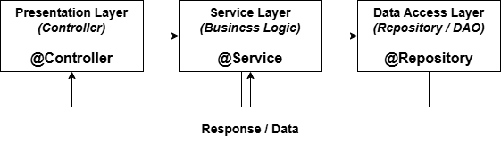

# Servicios y Lógica de Negocio con Spring

¡Hola! En esta clase, vamos a organizar y mejorar la forma en que manejamos la lógica de negocio en nuestras aplicaciones Spring. Aprenderemos a separar las responsabilidades de manera efectiva y a construir servicios robustos.

### ¿Qué pasaría si no existiera la capa de servicio?

Veamos un ejemplo de controlador sin capa de servicio.

Supongamos un sistema bancario sin capa de servicio:
```java 
@PostMapping("/transferir")
public void transferir(...) {
    // validar
    // verificar saldo
    // descontar
    // guardar
}
```
Todo mezclado = difícil de probar, reutilizar y escalar.

Con capa de servicio:

```java 
@PostMapping("/transferir")
public void transferir(...) {
    servicio.transferir(...);
}
```
```java 
@Service
public class ServicioBancario {
    public void transferir(...) {
        // reglas de negocio reales
    }
}
```

## 1. ¿Por Qué una Capa de Servicio? Introducción y Contexto

### El Problema: Lógica de Negocio en el Controlador

En el patrón Model-View-Controller (MVC), los controladores se encargan de recibir las peticiones del usuario, interactuar con el modelo y seleccionar la vista adecuada. Son la puerta de entrada a nuestra aplicación.

Sin embargo, si ponemos toda la lógica de negocio (reglas, cálculos, validaciones complejas, coordinación de acciones) directamente en los controladores, estos se vuelven:

* **Voluminosos y difíciles de leer:** Acumulan demasiadas responsabilidades.
* **Difíciles de mantener:** Un cambio en la lógica de negocio afecta directamente a la capa de presentación.
* **Difíciles de probar:** Probar la lógica de negocio requiere levantar todo el contexto web del controlador.
* **Poco reutilizables:** La misma lógica no puede ser fácilmente invocada desde otras partes de la aplicación (ej. una tarea programada, una API interna).

### La Solución: El Patrón Service Layer

El patrón Service Layer (Capa de Servicio) introduce una capa intermedia entre la capa de presentación (controladores) y la capa de acceso a datos (repositorios). Su propósito principal es encapsular la lógica de negocio.

**El Service Layer es donde reside la "inteligencia" de tu aplicación.**

**Beneficios Clave:**

* **Separación de Responsabilidades:** Los controladores se enfocan solo en manejar peticiones y respuestas HTTP. Los servicios se enfocan en *qué* hacer con los datos y *cómo* realizar las operaciones de negocio.
* **Mayor Cohesión:** Cada clase (controlador, servicio, repositorio) tiene una responsabilidad clara y única.
* **Menor Acoplamiento:** Los controladores dependen de interfaces de servicio, no de implementaciones concretas o lógica detallada. Esto facilita cambiar implementaciones o probar componentes de forma aislada.
* **Reutilización:** La lógica de negocio en los servicios puede ser invocada por múltiples controladores u otros componentes de la aplicación.
* **Mantenibilidad:** Los cambios en la lógica de negocio se localizan principalmente en la capa de servicio, reduciendo el riesgo de efectos secundarios inesperados en otras partes.
* **Testabilidad:** Los servicios pueden ser probados fácilmente de forma unitaria, sin necesidad de configurar un entorno web o de base de datos completo.

## 2. Inversión de Dependencias con Spring

### Inversión de Control (IoC) y Inyección de Dependencias (DI)

Spring se basa fuertemente en los principios de Inversión de Control (IoC) y su implementación más común, la Inyección de Dependencias (DI).

* **IoC:** En lugar de que un objeto cree o gestione directamente sus dependencias, un contenedor (el contenedor de Spring) se encarga de crearlas y proporcionárselas al objeto cuando las necesita. Se "invierte" el control sobre la gestión de dependencias.
* **DI:** Es el mecanismo específico para lograr IoC. Las dependencias (otros objetos que una clase necesita para funcionar) son "inyectadas" en la clase, generalmente a través de constructores, métodos `setter` o campos.

El **Contenedor de IoC de Spring** es el corazón del framework. Es responsable de:

1. Instanciar los beans (los objetos gestionados por Spring).
2. Configurar los beans.
3. Gestionar el ciclo de vida de los beans.
4. Inyectar las dependencias entre beans.

## Formas de inyectar dependencias en Spring boot

### 1. Inyección por Atributo (Field Injection)
Es la más rápida de escribir, pero la menos recomendada en la actualidad. Se usa la anotación @Autowired directamente sobre la variable.

```java
@Service
public class ProductoService {
    @Autowired
    private ProductoRepository repository; // Inyectado directamente
}
```
Ventaja: Muy poco código.

Desventaja: Hace que las pruebas unitarias sean difíciles (necesitas levantar el contexto de Spring para rellenar ese campo) y oculta las dependencias de la clase, lo que puede llevar a clases gigantes que hacen demasiadas cosas.

### 2. Inyección por Setter
Se utiliza un método "setter" para recibir la dependencia. Era muy común en las primeras versiones de Spring.
```java
@Service
public class ProductoService {
    private ProductoRepository repository;

    @Autowired
    public void setRepository(ProductoRepository repository) {
        this.repository = repository;
    }
}
```
Ventaja: Permite que las dependencias sean opcionales o se cambien en tiempo de ejecución.

Desventaja: El objeto se crea primero "vacío" y luego se llena, lo que puede causar errores si intentas usarlo antes de que el setter se ejecute.

### 3. Inyección por Constructor (La más RECOMENDADA) 
Esta es la forma estándar y profesional de hacerlo hoy en día. Desde Spring 4.3, si solo tienes un constructor, ni siquiera necesitas poner la anotación @Autowired.

```java
@Service
public class ProductoService {
    private final ProductoRepository repository; // Puede ser 'final'

    public ProductoService(ProductoRepository repository) {
        this.repository = repository;
    }
}
```
#### ¿Por qué es la mejor?
Inmutabilidad: Al usar final, garantizas que la dependencia no cambie una vez que el objeto ha sido creado.

Facilidad de Testing: No necesitas Spring para probar esta clase. Puedes hacer new ProductoService(miRepoMock) en un test normal de Java.

Seguridad: El objeto nunca estará en un estado "incompleto". Si falta la dependencia, el código simplemente no compila o la aplicación no arranca.

Transparencia: Al ver el constructor, sabes exactamente qué necesita la clase para funcionar.

#### Un truco profesional: Lombok
Para no escribir el constructor a mano (que puede ser tedioso si tienes muchas dependencias), muchos desarrolladores usan la librería Lombok con la anotación `@RequiredArgsConstructor`:

```java
@Service
@RequiredArgsConstructor // Genera el constructor automáticamente para campos 'final'
public class ProductoService {
    private final ProductoRepository repository;
    private final OtroService otroService;
}
```
Esto genera exactamente el mismo código que la inyección por constructor, pero manteniendo tu clase limpia.

### Anotación Clave: `@Service`

Spring proporciona anotaciones para simplificar la configuración de IoC y DI:

* `@Service`: Es una anotación estereotipo (una anotación que marca la función o rol de una clase) que indica que una clase es un **componente de la capa de servicio**. Spring detectará automáticamente estas clases durante el escaneo de componentes y creará un bean de ellas en su contenedor. Semánticamente, la usamos para clases que contienen lógica de negocio.

    ```java
    @Service
    public class MyBusinessService {
        // Lógica de negocio aquí
    }
    ```


## 3. Separación por Capas: Profundizando en el Patrón Service Layer

Como mencionamos, el patrón Service Layer es una de las capas en la arquitectura de aplicaciones Spring:

* **Capa de Presentación:** Maneja la interacción con el usuario (controladores REST, controladores MVC para vistas, etc.). Su trabajo es recibir la entrada, validar datos básicos, pasar la solicitud a la capa de servicio y devolver una respuesta. **(Ej: Clases con `@RestController` o `@Controller`)**
* **Capa de Servicio (Business Logic):** Contiene las reglas de negocio, coordina las operaciones de acceso a datos si es necesario, realiza validaciones complejas y define las transacciones. No interactúa directamente con la base de datos o fuentes de datos externas; delega esta tarea a la capa de acceso a datos. **(Ej: Clases con `@Service`)**
* **Capa de Acceso a Datos (Data Access Object - DAO / Repository):** Es responsable de la comunicación directa con la fuente de datos (bases de datos, servicios externos, etc.). Proporciona métodos para realizar operaciones CRUD básicas sobre las entidades (guardar, leer, actualizar, eliminar). **(Ej: Interfaces que extienden `JpaRepository` o clases con `@Repository`)**



El Service Layer actúa como el **orquestador**. Un método en un servicio podría:

1. Recibir datos de un controlador.
2. Validar esos datos según reglas de negocio.
3. Invocar uno o varios métodos de diferentes repositorios para obtener o guardar información.
4. Realizar cálculos o transformaciones complejas con los datos.
5. Manejar la lógica transaccional.
6. Devolver un resultado al controlador.


## 4. Otras Anotaciones de Componentes de Spring

Además de `@Service`, Spring ofrece otras anotaciones estereotipo y de configuración importantes:

* `@Component`: Esta es la anotación estereotipo genérica. Cualquier clase anotada con `@Component` es candidata a ser gestionada como un bean por el contenedor de Spring. `@Service`, `@Repository` y `@Controller` son especializaciones de `@Component` que añaden semántica (significado) a la clase.

    ```java
    @Component
    public class UtilityClass {
        // Métodos de utilidad general
    }
    ```

    Aunque puedes usar `@Component` para servicios, es mejor usar `@Service` porque comunica más claramente el rol de la clase.

* `@Repository`: Anotación estereotipo para clases que actúan como **repositorios de datos** o DAOs (Data Access Objects). Indica que la clase tiene el rol de interactuar con la base de datos. Spring puede aplicar funcionalidades especiales a estas clases (como traducción automática de excepciones de base de datos).

    ```java
    @Repository
    public interface ProductRepository extends JpaRepository<Product, Long> {
        // Métodos para acceder a datos de productos
    }
    ```

* `@Controller`: Anotación estereotipo para clases que actúan como **controladores en la capa de presentación**, manejando peticiones web.

    ```java
    @Controller // Para MVC tradicional que devuelve vistas
    public class HomeController {
        // Maneja peticiones web
    }

    @RestController // Combinación de @Controller y @ResponseBody para APIs REST
    public class ProductController {
       // Maneja peticiones REST y devuelve datos directamente
    }
    ```

* `@Configuration` y `@Bean`: Estas anotaciones se utilizan para definir beans de Spring usando configuración basada en Java en lugar de escaneo de componentes.
  * `@Configuration`: Indica que una clase declara uno o más métodos `@Bean`. Spring procesará esta clase para generar beans.
  * `@Bean`: Se usa en un método dentro de una clase `@Configuration`. El método debe retornar un objeto que Spring registrará como un bean en su contenedor. El nombre del bean por defecto será el nombre del método.

    ```java
    @Configuration
    public class AppConfig {

        @Bean // Define un bean llamado 'myCustomBean'
        public MyCustomClass myCustomBean() {
            return new MyCustomClass();
        }

        @Bean // Define otro bean llamado 'anotherDependency'
        public AnotherDependency anotherDependency() {
            // Aquí puedes configurar la dependencia si es necesario
            return new AnotherDependency();
        }

        // Puedes inyectar otros beans de configuración en métodos @Bean
        @Bean
        public ServiceWithDependency myServiceWithDependency(@Autowired AnotherDependency anotherDependency) {
             return new ServiceWithDependency(anotherDependency);
        }
    }
    ```

    Usas `@Configuration` y `@Bean` principalmente cuando necesitas crear beans de clases de terceros (que no puedes anotar con `@Component`), o cuando necesitas lógica compleja para crear o configurar un bean.


## 5. Implementando el Servicio LibroService con Cursor AI

Ahora, vamos a aplicar estos conceptos creando un servicio real para gestionar libros.

Nuestro `LibroService` encapsulará la lógica de negocio relacionada con los libros. Para simplificar, usaremos una `List` en memoria para almacenar los datos, simulando una fuente de datos temporal.

Primero, definiremos una clase simple `Libro`:

```java
public class Libro {
    private String isbn;
    private String titulo;
    private String autor;
    // Constructor, getters y setters
    // ... (puedes usar la generación de código de Cursor AI para esto)
}
```

Luego, crearemos la interfaz `LibroService` (opcional, pero recomendado para desacoplamiento y testabilidad):

```java
import java.util.List;

public interface LibroService {
    List<Libro> listarLibros();
    Libro buscarPorTitulo(String titulo);
    void agregarLibro(Libro libro);
    void eliminarLibro(String titulo); // Simplificamos buscando por título
}
```

Y la implementación de nuestro servicio, anotada con `@Service` para que Spring la gestione:

```java
import org.springframework.stereotype.Service;
import java.util.ArrayList;
import java.util.List;
import java.util.Optional; // Para manejar el resultado de la búsqueda

@Service
public class LibroServiceImpl implements LibroService {

    private final List<Libro> listaLibros = new ArrayList<>(); // Nuestra "base de datos" en memoria

    @Override
    public List<Libro> listarLibros() {
        // Lógica para listar
        return new ArrayList<>(listaLibros); // Devolver una copia para evitar modificaciones externas
    }

    @Override
    public Libro buscarPorTitulo(String titulo) {
        // Lógica para buscar
        Optional<Libro> found = listaLibros.stream()
                                          .filter(libro -> libro.getTitulo().equalsIgnoreCase(titulo))
                                          .findFirst();
        return found.orElse(null); // Devuelve el libro si lo encuentra, null si no
    }

    @Override
    public void agregarLibro(Libro libro) {
        // Lógica para agregar
        if (libro != null && buscarPorTitulo(libro.getTitulo()) == null) { // Simple validación: no duplicados por título
            listaLibros.add(libro);
        }
    }

    @Override
    public void eliminarLibro(String titulo) {
        // Lógica para eliminar
        listaLibros.removeIf(libro -> libro.getTitulo().equalsIgnoreCase(titulo));
    }
}
```

Finalmente, inyectaremos este servicio en un controlador simple para poder invocar sus métodos desde peticiones HTTP:

```java
import org.springframework.beans.factory.annotation.Autowired;
import org.springframework.web.bind.annotation.*;

import java.util.List;

@RestController // O @Controller con @ResponseBody
@RequestMapping("/api/libros")
public class LibroController {

    private final LibroService libroService;

    @Autowired
    public LibroController(LibroService libroService) {
        this.libroService = libroService;
    }

    @GetMapping
    public List<Libro> getAllLibros() {
        return libroService.listarLibros();
    }

    @GetMapping("/{titulo}")
    public Libro getLibroByTitulo(@PathVariable String titulo) {
        return libroService.buscarPorTitulo(titulo);
    }

    @PostMapping
    public void addLibro(@RequestBody Libro libro) {
        libroService.agregarLibro(libro);
    }

    @DeleteMapping("/{titulo}")
    public void deleteLibro(@PathVariable String titulo) {
        libroService.eliminarLibro(titulo);
    }
}
```

## 6. Conclusiones

Hemos visto cómo el patrón Service Layer es esencial para construir aplicaciones Spring bien estructuradas y mantenibles. Separar la lógica de negocio en servicios dedicados mejora la organización, la reutilización y la testabilidad.

Dominar el uso de anotaciones como `@Service`, `@Autowired`, `@Component`, `@Bean`, y `@Configuration` es fundamental para trabajar con el contenedor de IoC de Spring.


¡Manos a la obra!
